# Lab 3

## Tools
* [Kali Linux](https://www.kali.org/get-kali/#kali-platforms) or similar Linux distro
* Another machine/Virtual machine with [Metasploitable2](https://sourceforge.net/projects/metasploitable/files/Metasploitable2/) or similarly vulnerable OS 
* NMap
* Zenmap
* Masscan

## Step 1 - Nmap
The first step in this lab is to disable "Docker" as it can interfere with step 11 of the lab

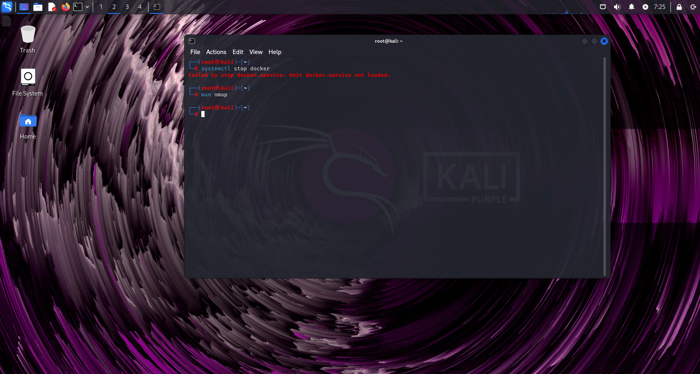

Next, I use `man nmap` to bring up its manual to read through its uses and commands. Once I'm done I press `Q` to exit back to the terminal.

## Step 2
I then use `nmap [target_IP]` to scan for all open ports. On this machine we can see lots of open TCP ports to attack.

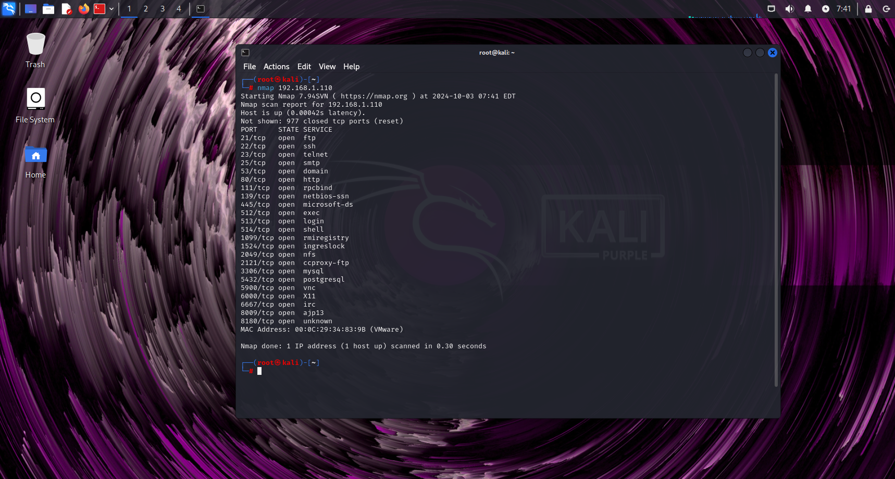
I attempted to ping OWASP's BWA machine but was unable to access it, so I used a vulnerable machine running metasploitable OS in my lab.

I then used `nmap -F [target_IP]` to scan the most popular ports.

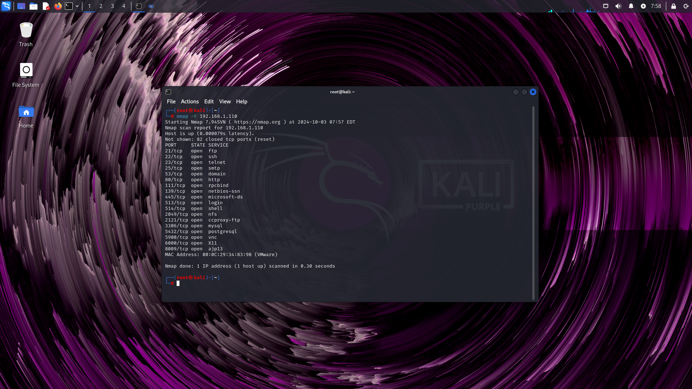

## Step 3
Now that I know my target host has vulnerabilities, I use `nmap -A [target_IP]` to scan for versions of software running on the ports

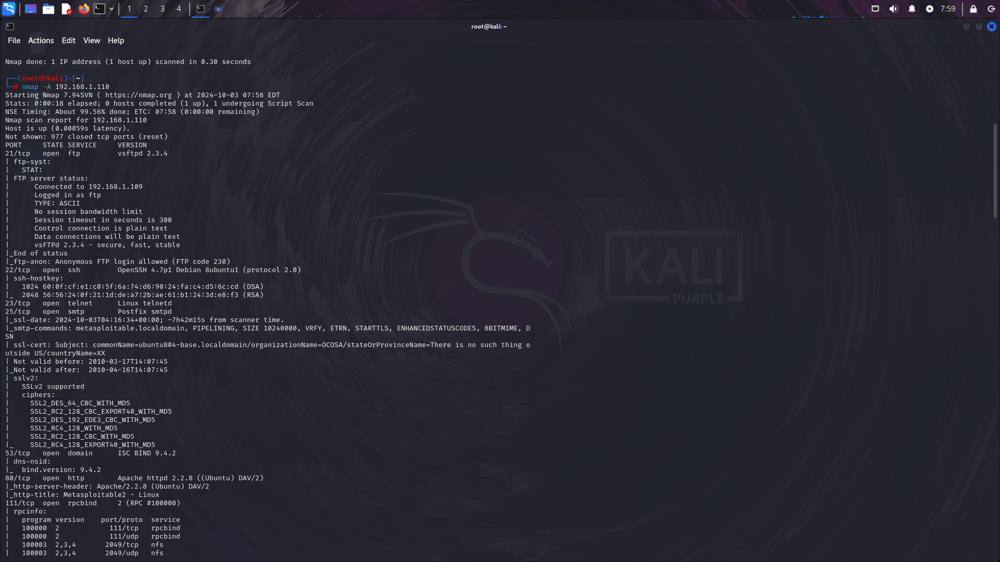

## Step 4
After waiting some time for the previous command to run, I `nmap -sC [target_IP]` to run a default set of scripts set by NMap. This set of scripts scan and assess vulnerabilities found on the target IP

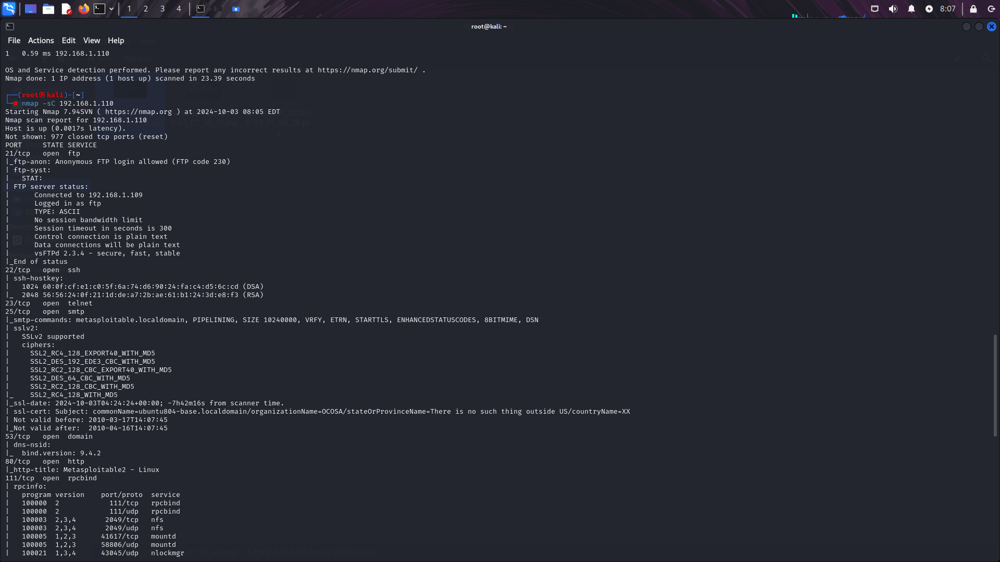

## Step 5 - Zenmap
In the same terminal, type `zenmap` and enter. Zenmap should open. In my case zenmap was not install so it was promptly installed using the `sudo apt install zenmap` command

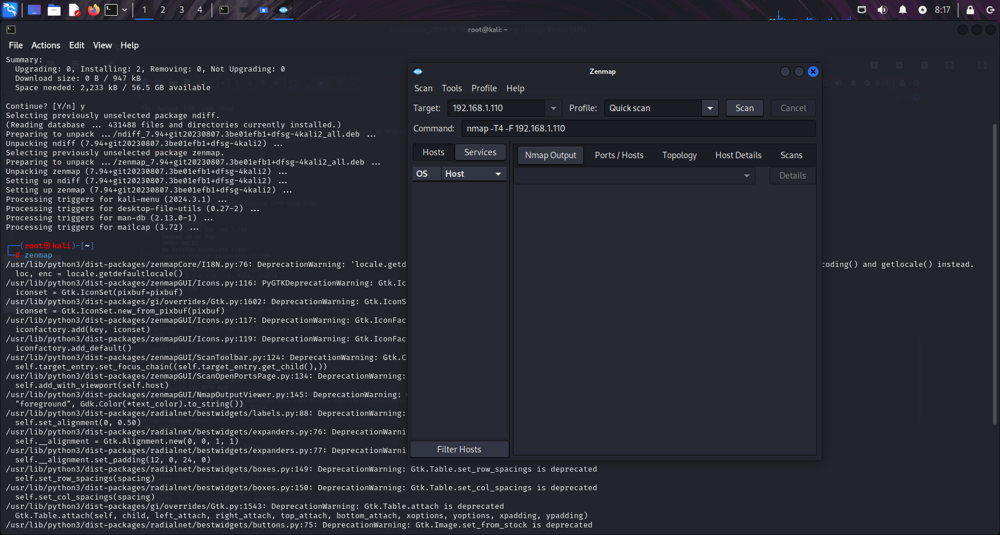

Once in zenmap, I navigated the 'Profile:' dropdown menu and selected 'Quick Scan'. Then I moved to the left to 'Target:' and I input the target's IP. Finally, I pressed 'Scan'

## Step 6
This command gives a similar output as the Nmap scan, showing all open TCP ports and the services that can be used to access these ports

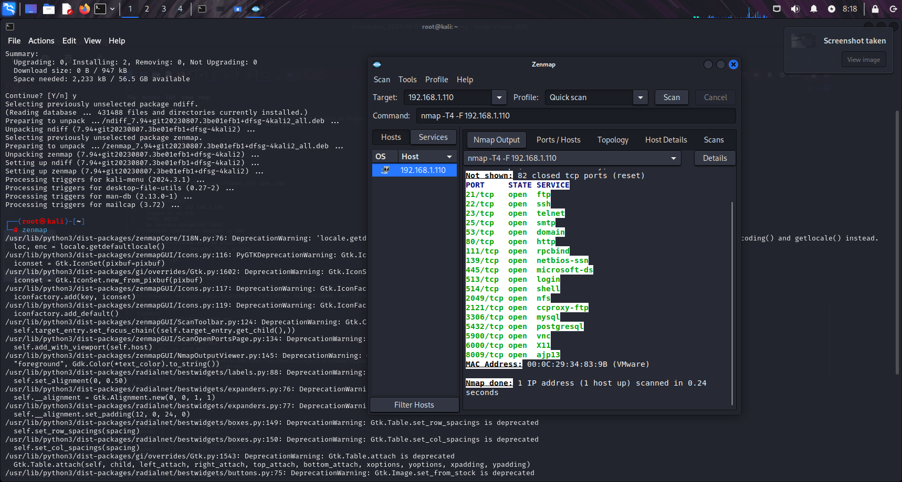

I move over to the 'Ports/Hosts' tab to view the output in an easy to read way.

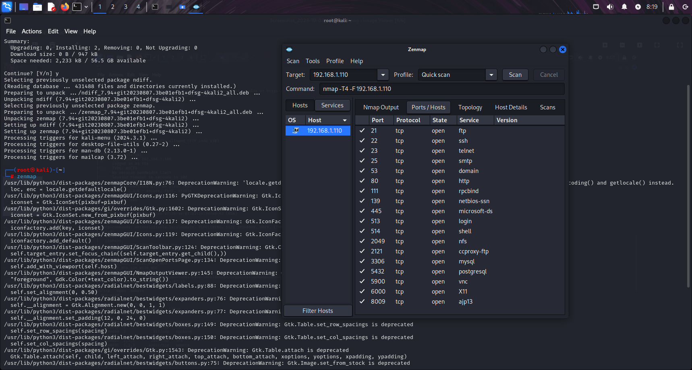

## Step 7
I then clicked on "Scan" in the top left to access the dropdown menu. From there I saved the current scan under the name 'scan.xml' for easy access later

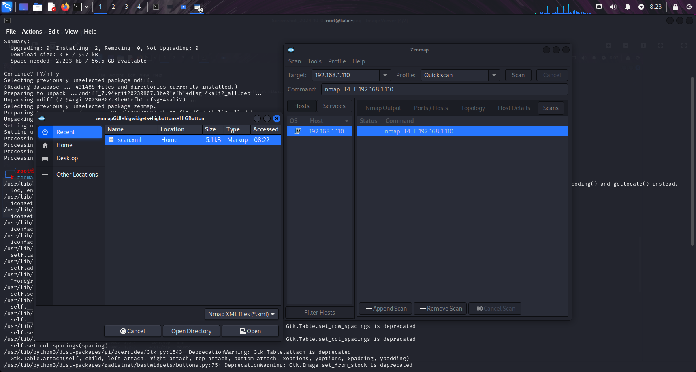

## Step 8
I then proceeded to scan the entire network the target was connected to. To do this, i changed the target to scan the entire network by including a range at the end of the target ip
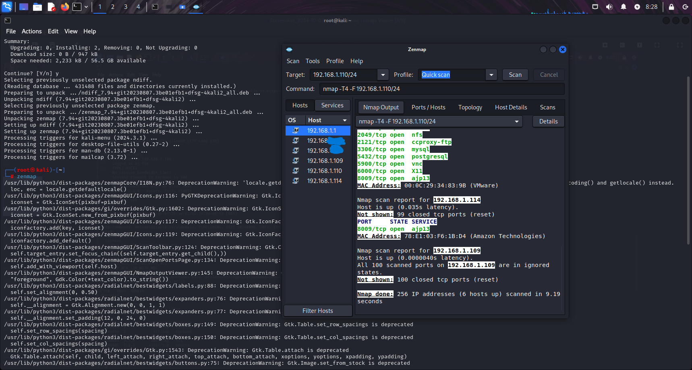

## Step 9
I moved over to the toplogy tab which shows a visual representation of the network and its connected devices. My network topology accurately displays the layout of my Home-Lab and which devices are connected to the network.

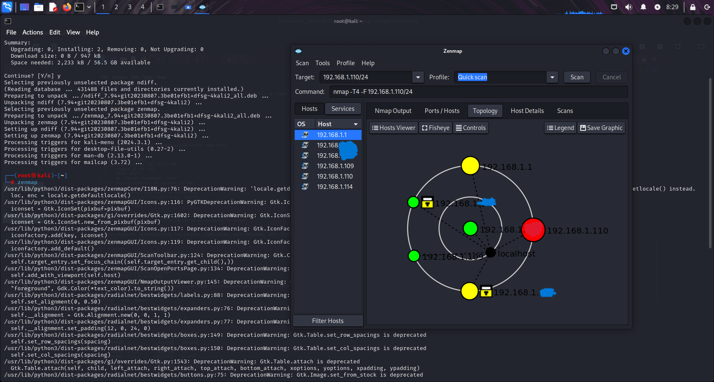

## Step 10 - Masscan
After closing off the Zenmap GUI and using the same terminal, I entered `man masscan` to bring up a list of its commands and uses.
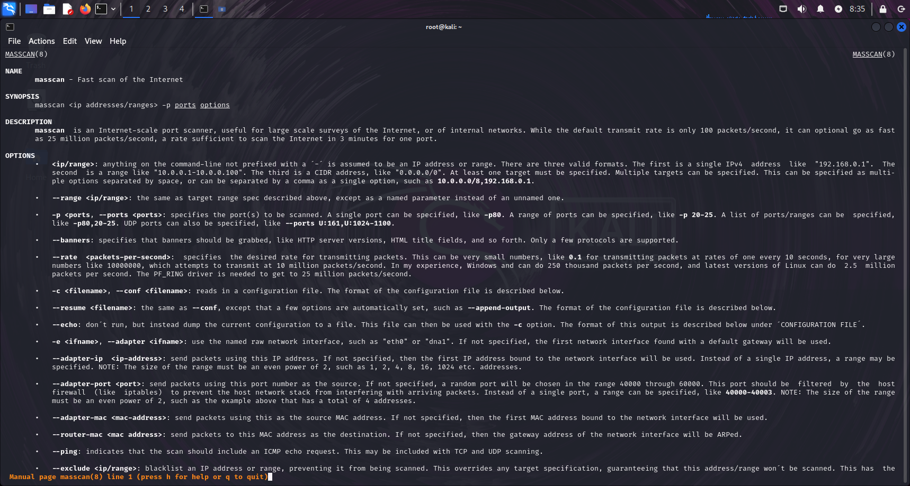

After reviewing the content, i press `Q` to exit to the terminal once more.

## Step 11
The first command used is `masscan --nmap`. What this command does is it optimizes masscan to output its information so that it's compatible with Nmap.
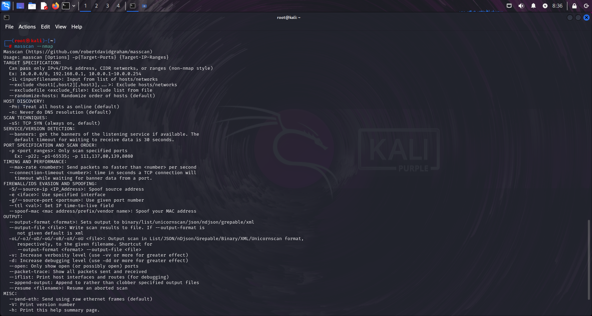

## Step 12
The first scan done is a network scan for devices with port 80 open. This is a TCP port that can be accessed through the HTTP (not HTTPS) service. Running `masscan -sS [target_IP]` executes a stealth scan
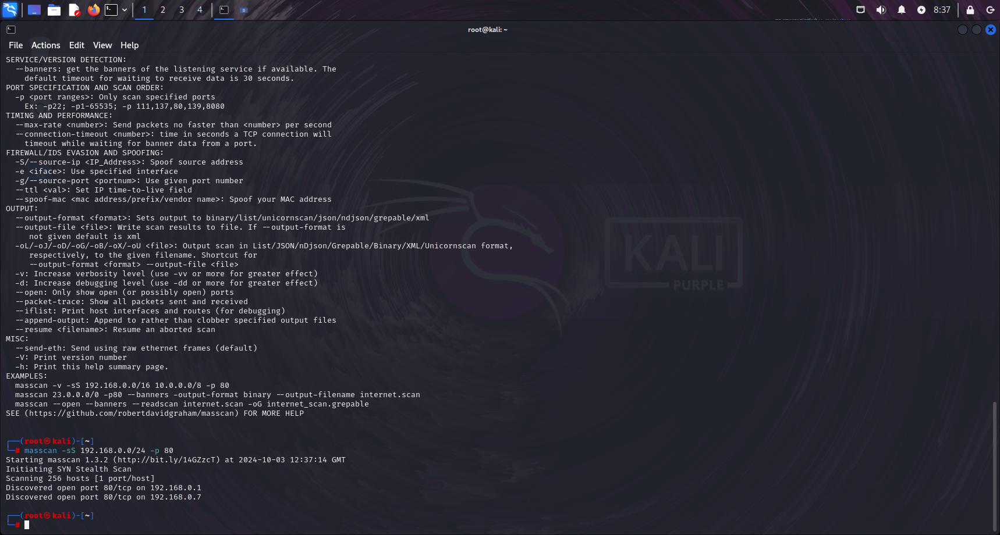

