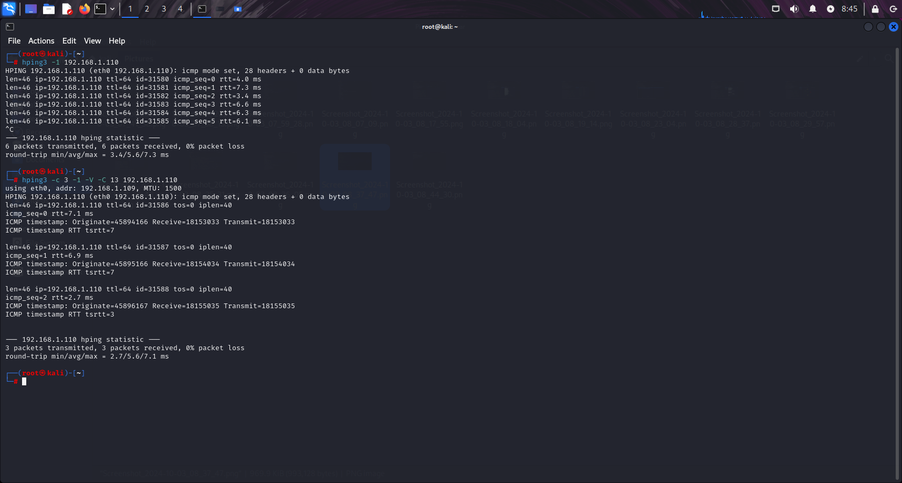
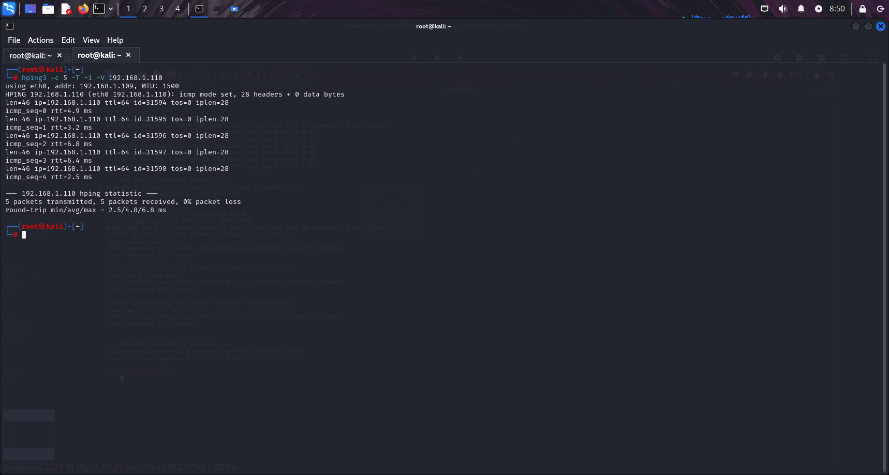
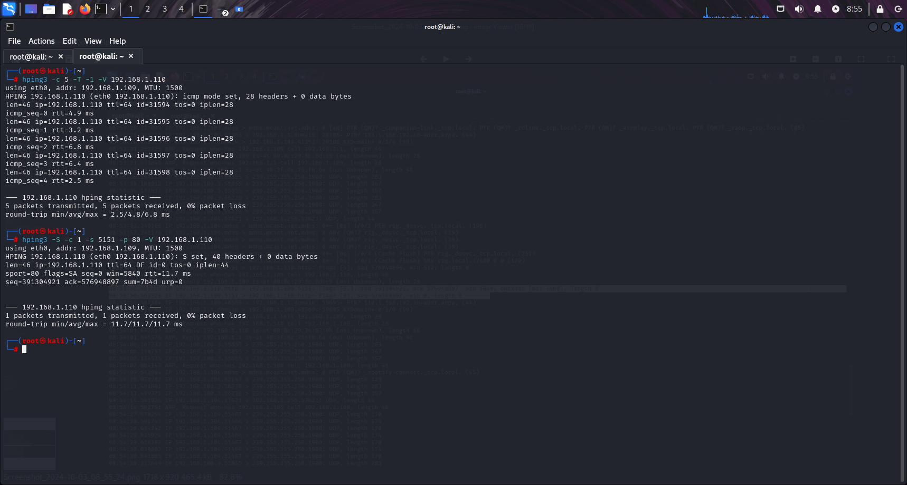
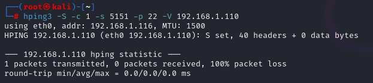
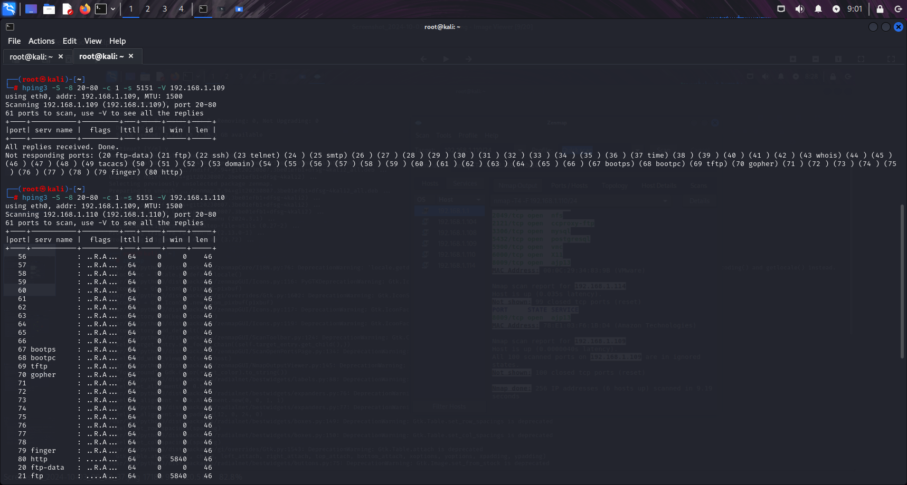

# Lab 3

## Tools
* [Kali Linux](https://www.kali.org/get-kali/#kali-platforms) or similar Debian Linux distro
* Another machine/Virtual machine with [Metasploitable2](https://sourceforge.net/projects/metasploitable/files/Metasploitable2/) or similarly vulnerable OS 
* hping3


## Step 1 - hping3 as ICMP Utility
The first step in this lab is to run the command `hping3 -1 [target_IP]` to send packets to the target IP. After 6 packets the script was stopped by pressing ```CTRL+C```


## Step 2
Next execute `hping3 -c 3 -1 -V -C 13 [target_IP]` to target a different ICMP and only send 3 packets.


## Step 3
The command `hping3 -c 5 -T -1 -V [target_IP]` incrementally increases the TTL (Time to Live) of the packets sent, allowing the user to map out the network path



## Step 5 - hping3 for Port Scanning
Open a new terminal window and enter `tcpdump -i eth0` and allow it to run in the background. This command captures and displays all network traffic on the eth0 interface and displays it in real time.
Swap back to the first terminal and enter `hping3 -S -c 1 -s 5151 -p 80 -V [target_IP]` to send a single packet to port 80 ith a source port of 5151. As this command also runs in verbose mode, there will be more detailed information about the packet and response 


## Step 6
Go back to the tcpdump terminal and search for your SYN and RST flags.


## Step 7
Swap back to the other terminal and enter `hping3 -S -c 1 -s 5151 -p 22 -V [target_IP]` to ping the firewall. We expect 100% packet loss as port 22 should be closed on the firewall.



## Step 8
Scan the firewall for open ports by executing `hping3 -S -8 20-80 -c 1 -s 5151 -V [target_IP]`
As seen below the vulnerable OS has many open firewall ports

